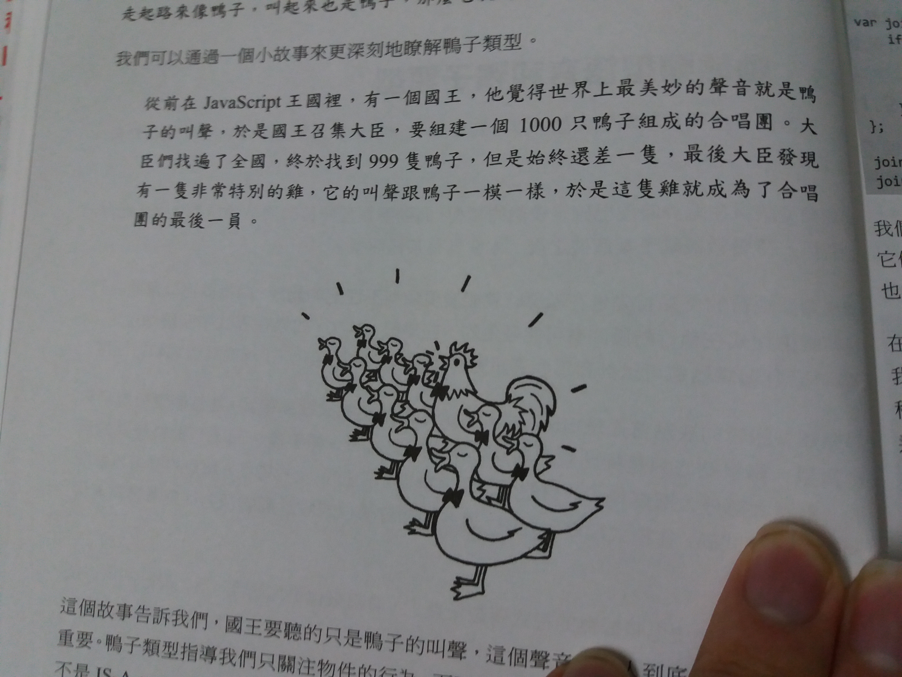

# 物件導向的的javascript

## 鴨子的範例(來源：書本P.4)

將以上例子以程式碼來呈現

    var duck= {
        duckSinging: () => console.log('嘎嘎嘎')
    }

    var chicken= {
        dickSinging: () => console.log('嘎嘎嘎')
    }

    var choir=[]; //合唱團

    var joinChoir=(animal) =>{
        if(animal && typeof(animal.duckSinging==='function')) {
            choir.push(animal)
            console.log('恭喜加入合唱團')
            console.log('合唱團已有成員數量: '+choir.length)
        }
    }

    joinChoir(duck)
    joinChoir(chicken)

以node執行

    node program1.js

出現以下結果

    恭喜加入合唱團
    合唱團已有成員數量: 1
    恭喜加入合唱團
    合唱團已有成員數量: 2

我們可以發現，在joinChoir我們不需要去檢查animal是"哪一種"，只需要去檢查animal有沒有duckSinging方法。
這就是物件導向的概念，在設計模式的事件中，這叫做"介面導向設計"，是為設計模式的重要思想。
